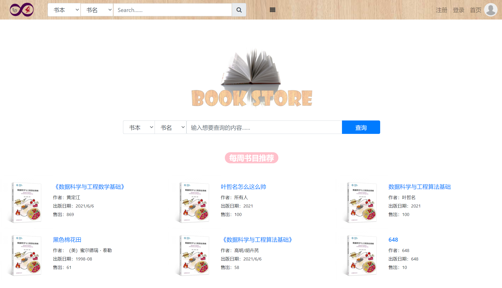
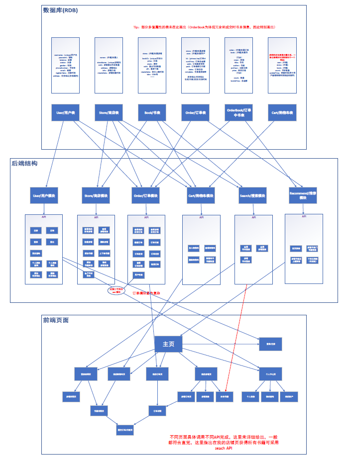
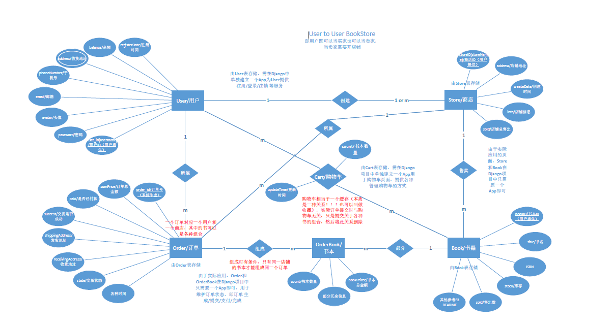
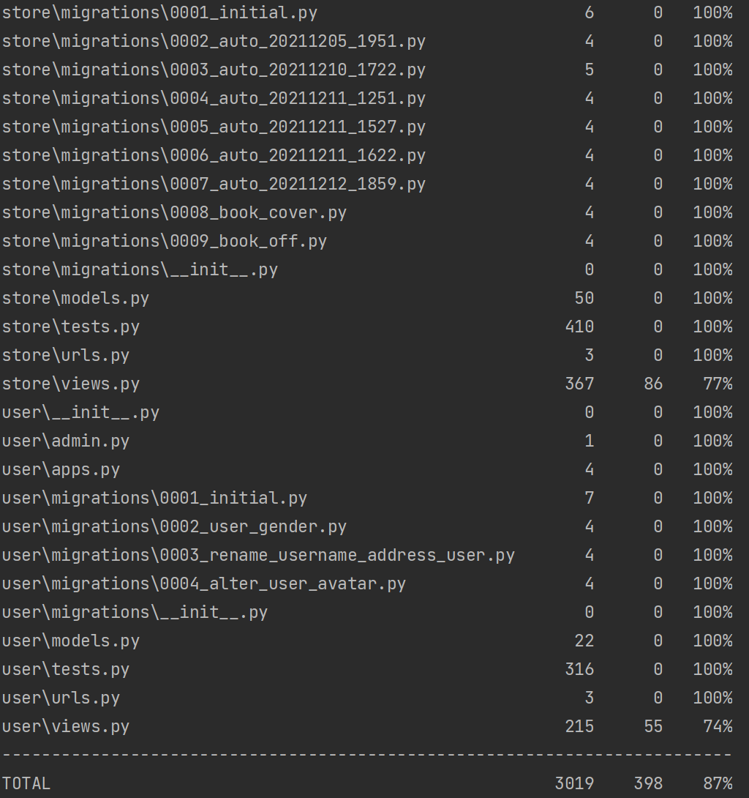

# BookStore

注意本项目的Django DB部分已删除个人阿里云信息，且SECRETKEY也已隐藏。

### 项目简介：
·	实现一个提供网上购书功能的网站。
·	网站支持书商在上面开商店，购买者可以通过网站购买。
·	买家和卖家都可以注册自己的账号。
·	一个卖家可以开一个或多个网上商店
·	买家可以为自已的账户充值，在任意商店购买图书。
·	支持下单->付款->发货->收货 流程。
·	支持将喜欢的书本加入购物车
·	支持修改个人信息、修改密码、修改头像
·	支持修改店铺信息、删除店铺
·	支持添加书本、下架书本、上架书本、修改书本价格
·	支持买家查看所有订单，店铺查看所有店铺订单
·	支持买家取消订单，订单15分钟内未付款自动失效
·	支持全局搜索书本，搜索书店
·	支持店铺内搜索书本
·	支持首页推荐（最热店铺、最热书本、最近上新书本）
·	支持店内推荐（本店最热书本、最近上新书本）

项目采用Python Django框架编写后端所有代码（包含测试用例），总共实现38个接口，140+测试用例（均通过），项目代码总覆盖率90%+(其中接口覆盖率70%+)，并包含Vue前端实现，前后端均纯原创！是一个完全可以上线使用的项目！

目前项目已在阿里云部署：http://139.196.42.152/，可直接访问并测试。（**现已失效**）
以下为首页

### 项目分工：
·	组长：郑逸潇（贡献度35%），主要负责数据库架构、系统整体架构、后端代码编写，前端UI图像设计，及部分测试用例编写。
·	组员：叶哲名（贡献度35%），主要负责前端页面编写、页面设计、需求分析，及部分测试用例编写。
·	组员：宋天民（贡献度30%），主要负责测试用例编写和部分后端代码编写，项目上云。
协作采用版本控制Git完成，由于“水杉码园”的版本控制无法拉取另外的分支（即选择分支后git clone的依旧是主分支），因此仅前端及接口文档使用水杉Git，其余协作均在本地Git完成。

### 项目结构：
采用Django3.2版本，配合Vue.js前端，使用PyCharm + VSCode编写代码。在附件中有BookStore文件夹，即项目文件夹。
其中的BookStore为配置文件，user/store/order…为项目App，dist为前端Vue打包好的页面。

系统整体架构设计：

（详情见BookStore系统架构.pdf）

### 需求分析：
（详情见需求分析.docx）

### API定义：
（详情见API_doc文件夹）

### 前端设计：

1、	前端框架
·框架：Vue
·脚手架：Vue-cli
2、	编程语言
·javascript
·HTML 
·css
3、	第三方插件
·jquery
·bootstrap
4、	实现Vue组件(components)
·App.vue
·register.vue：用户注册
·login.vue：用户登录
·addstore.vue：新建店铺
·balance.vue：查看余额/余额充值
·book.vue：书本详情页
·bookresult.vue：书本查询结果
·buystore.vue：店铺详情页
·information.vue：个人信息
·mycart.vue：我的购物车
·myorder.vue：我的订单
·mystore.vue：我的店铺
·order.vue：生成订单
·orderinfo.vue：订单详情页
·password.vue：修改密码
·store.vue：店铺主页
·storeorderinfo.vue：店铺订单详情页
·storeorders.vue：店铺订单
·storeresult.vue：店铺查询结果
·TagsInput.vue：标签组件（book.vue的子组件）
·tmp.vue：中间跳转页
·unregister.vue：注销用户

### 数据库设计：

项目需要有买家和卖家的区别，但是实际上他们可以由同一个表存储，所以开始时设计数据库就有两种结构，一为（User to User 设计），另一为（Seller to Buyer 设计），为方便前端设计以及后端架构，采用User to User设计。

#### ER图设计（详情见BookStoreER图设计.pdf）：

针对此ER图建立了多个表，并采用Django ORM框架进行编写。
（具体参考Django App中所有models.py中的class）

### 后端结构：
编写error.py提供所有ERROR信息和ERROR_CODE，编写function.py提供一些常用的函数/装饰器（均在BookStore文件夹内，与配置文件settings.py并列）。
	由于后端大部分需要操作数据库，因此在每次操作数据库时基本都需要try和抛出异常，这也是本项目代码的主要组成部分
后端总共建立六个Django App：user App负责用户认证模块、store App负责书店相关模块、order App负责订单相关模块、cart App负责购物车模块、search App负责搜索模块、recommend App负责推荐模块。

user App基本不会使用到事务处理，主要处理用户名不存在or重复or密码错误等问题，具体实现参考项目代码。
store App也基本不会使用事务处理，主要处理建立、删除店铺、上传书本、上下架书本、查看店铺、书本信息等。具体实现参考项目代码。
order App是本项目最复杂的模块，主要处理订单的创建、支付、查看、发货、收货等，多次使用事务处理，本项目采用Django ORM框架提供的事务处理接口transaction，只需在每组需要进行原子化的操作前使用with transaction.atomic( ): 然后编写操作数据代码即可，这种方式当有出现数据库错误时会自动回滚，保证事务原子性，但是当中间的代码是人为跳出时（比如购买书时库存不足，需人为跳出事务，此时需要在事务开始时设置断点，然后判断库存不足时需人为恢复到断点），同时还需要设置一个定时器，对每个订单定时取消，定时器采用apscheduler。具体实现参考项目代码。事务处理部分可在项目中搜索atomic查看有关事务处理的代码。
cart App的模型类cart本质是一种关系，user收藏book的关系，此App主要处理查看、添加、删除购物车等，具体实现参考项目代码。
search App无需建立模型类，只需调用store App中的所有模型类进行搜索即可，由于项目较小，搜索引擎的设计并没有设计倒排索引，而是直接分词、获得每个词的书，然后取交集即为用户所查的书，可提供按书本的title/content/tags/author/book_intro和店铺的名字/地址搜索，可提供按售出/上传时间/出版时间排序，并未实现相关推荐等。（具体参考搜索结构.docx/搜索引擎设计.docx）
recommend App同样无需建立模型类，只需查看历史订单，并根据一段时间内，订单中所售出的书本/售出书本的店铺，来推荐每周热门店铺/书本，具体实现参考项目代码。

### 项目测试：
本项目采用Django自带的Test模块，即编写每个App中的tests.py文件。针对views.py中每个view编写测试用例。
项目测试方法（在项目根目录下，即manage.py文件同级目录下）：

	python manage.py test

查看覆盖率的测试方法（需下载coverage包(pip)）：

	coverage run --source='.' manage.py test

然后report：

	coverage report

结果：

其中接口覆盖率达到user 74%、store 77%、order 66%、cart 67%、search 90%、recommend 78%。

吞吐量测试Jmeter：
由于本项目事务处理会加锁，因此在Jmeter中只要过多的同一request就会导致死锁，导致吞吐量降低。

### 项目部署：
#### 本地项目运行方法：
	python manage.py runserver
即可在本地8000(默认，可修改)端口启动Django项目

#### 项目上云
采用uwsgi + nginx服务器部署，即将Django服务托管给uwsgi进行对外提供服务，nginx提供负载均衡和静态资源代理。（需安装uwsgi(pip) 和nginx）

### 实验结论：
是目前做的较全较大的项目（后端开发代码量2300+/测试代码量3000+/前端代码量2500+），实现了一个完整的Web应用，整体代码锻炼了团队协作能力，增强了对数据库事务处理的理解，采用了前后端分离的架构（Django + Vue），熟悉了Web软件开发的整体流程（需求分析、前端页面设计、接口文档定义、数据库设计、后端结构设计、项目云上部署）。
